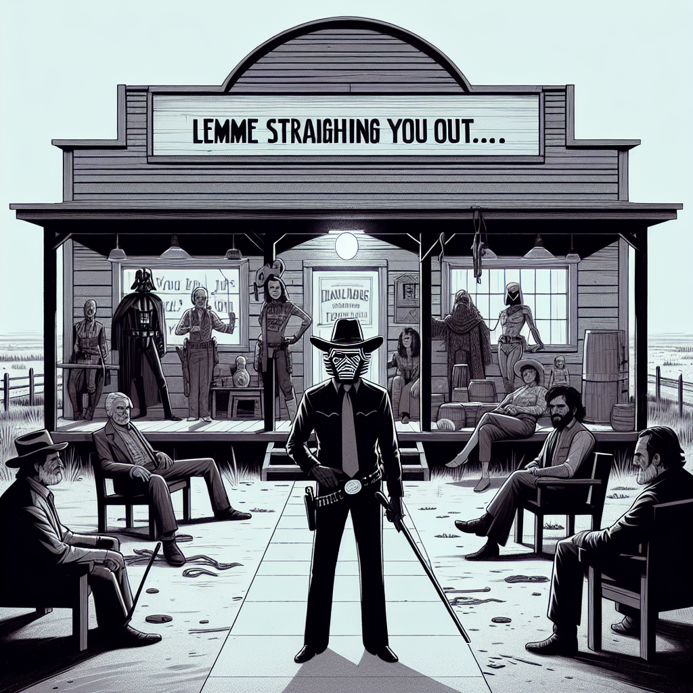

# Let's illustrate Zappa songs with Dalle

The idea here is to create fun pages that are based on Frank Zappa songs.

To run the code, just run

`% node generateImages.js`

It is a little fragile. If it hits the image limit it will wait for a minute.  If it hits the content
filtering, it will also wait and retry.

These retries never stop, so it might get stuck.

You can add your own lyrics by just changing the lyrics array. 

The API key is taken from your environment, so you'll have to set that.

 

I started with the lyrics from Stinkfoot.  This song has always elicited strong images in 
my imagination.  Here's what Dalle came up with for the first few verses.

# [Stink-Ffoot by Frank Zappa](https://open.spotify.com/track/5nV609B7jqDuKEupcerPTK) <em>Spotify</em>

In the dark, Where all the fevers grow

  Under the water, Where the shark bubbles blow

 

In the mornin', By your radio

Do the walls close in to suffocate ya

You ain't got no friends..., An' all the others they hate ya?

There's the life you been leadin' gotta go

Well, lemme straighten you out, About a place I know...

Get your shoes 'n socks on people because it's right aroun' the corner!

 This must be the disease for you

Now scientists call this disease Bromhidrosis

 But us regular folks who might wear tennis shoe

 Or an occasional python boot

Know this exquisite little inconvenience by the name of stinkfoot

# Logs...

# getting setup

npm install openai axios fs-extra

# this is the correct api 

https://platform.openai.com/docs/api-reference/images/create?lang=node.js

Hit the rate limit.  It's 5 per minute...

# 2024-02-25 15:32:17

  "Do the walls close in to suffocate ya",
This triggered a "content violation".

How do we get around this?

Just add some retry code.

# 2024-02-25 16:32:58

Should make the image names from the lyrics...